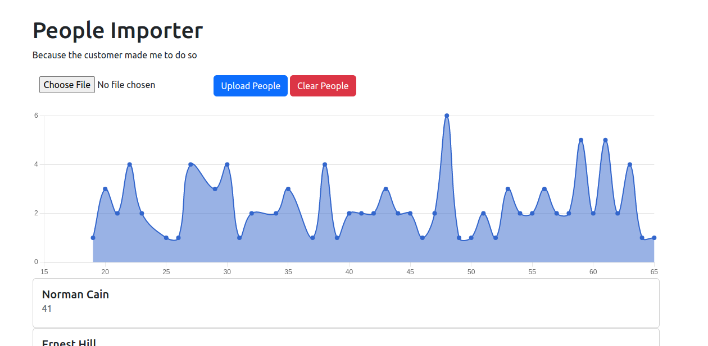

# README

Things you may want to cover:

* Ruby version - "3.1.2"

* System dependencies - Rails 7 

* Configuration - Web server : NGINX

* Database creation - rake db:create

* Database initialization - rake db:migrate 

* How to run the test suite - rake test

* Services (job queues, cache servers, search engines, etc.)

* Deployment instructions - DO or Heroku

